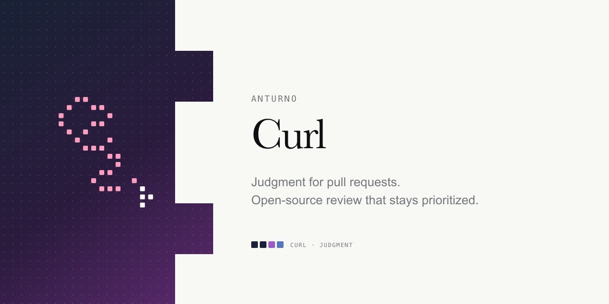

# Curl




Curl is an open-source GitHub pull request reviewer. Ask it to look at a PR and
it posts **one clear summary**: correctness and security issues first, ranked by
severity. Noise stays out of the way.

## What you get

- **Correctness** — logic bugs, broken contracts, risky edge cases
- **Security** — auth gaps, injection, secret leaks, and similar issues in the diff
- **One comment** — a prioritized digest you can act on, not a pile of optional nits

On a pull request:

```text
@anturno-curl review
```

## Why it exists

Most review bots optimize for volume. Curl optimizes for signal: fewer comments,
higher stakes. Self-host it, bring your own model key, run it on the repos you
choose — including this one.

## Get started

Install and deploy: **[docs/install.md](./docs/install.md)**

Curl is mention-driven only. Ask it with `@anturno-curl review` on a pull
request, and it checks only the changed files. There are no automatic reviews,
check runs, or web hooks beyond the GitHub App webhook. See the
[configuration guide](./docs/configuration.md) for the exact permissions and
environment values.

For local changes, run `bun run check`, `bun run typecheck`, and `bun test`.
Keep secrets in `.env.local` or the deployment secret store.

## Docs

- [Install](./docs/install.md)
- [Configuration](./docs/configuration.md)
- [Troubleshooting](./docs/troubleshooting.md)
- [Architecture](./docs/architecture.md)
- [CurlOS](https://github.com/anturno/curlos) — read-only review workspace runtime
- [Contributing](./CONTRIBUTING.md)
- [Security](./SECURITY.md)
- [Changelog](./CHANGELOG.md)

## License

[Apache-2.0](./LICENSE)
